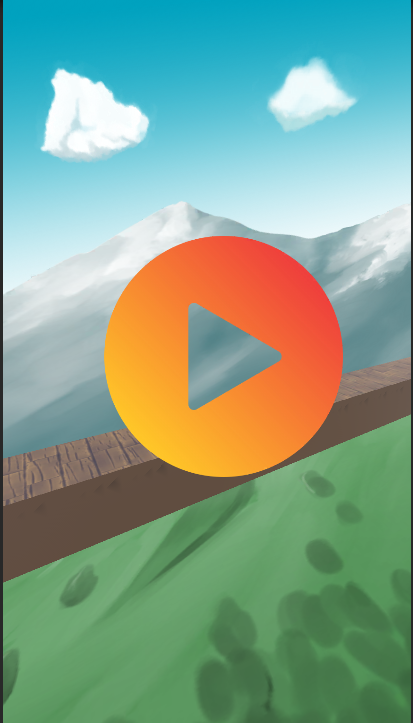
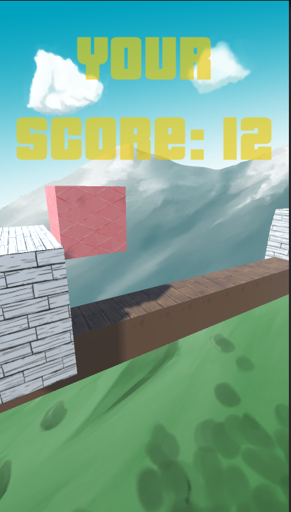
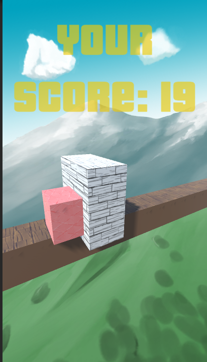
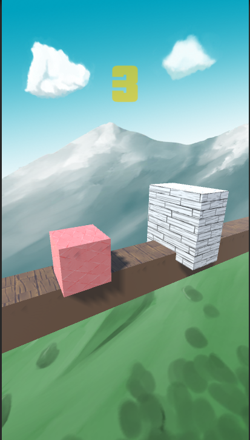

# CubeRunner
# Unity Endless Runner Game

Welcome to the Unity Endless Runner Game! This game is an endless runner where you control a character that runs through a challenging obstacle course. Your goal is to survive as long as possible and collect points along the way.

## Table of Contents

- [Getting Started](#getting-started)
- [Gameplay](#gameplay)
- [Contributing](#contributing)
- [ScreenShots](screenShots)

## Getting Started

To play the game, follow these steps:

1. Clone the repository to your local machine.
2. Open the project in Unity.
3. Navigate to the starting scene or level.
4. Run the game by clicking the "Play" button in the Unity Editor.

## Gameplay

- You control the character's jumps by tapping or clicking the screen.
- Avoid obstacles in your path to stay alive.
- Collect points as you progress through the course.
- The game keeps track of your score, and you can try to beat your high score on subsequent runs.

## Contributing

Contributions are welcome! If you'd like to contribute to the project, please follow these steps:

1. Fork the repository.
2. Create a new branch for your feature or bug fix.
3. Make your changes and test them thoroughly.
4. Submit a pull request with a clear description of your changes.

## ScreenShots

    
    
   
   

